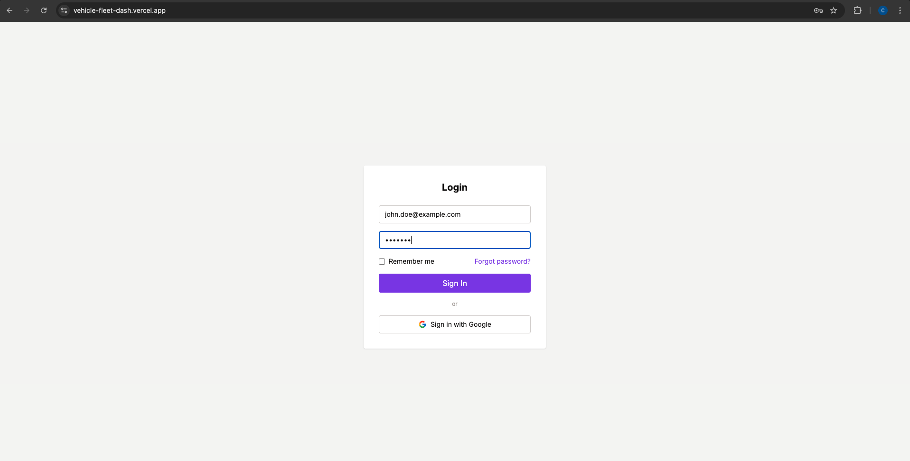
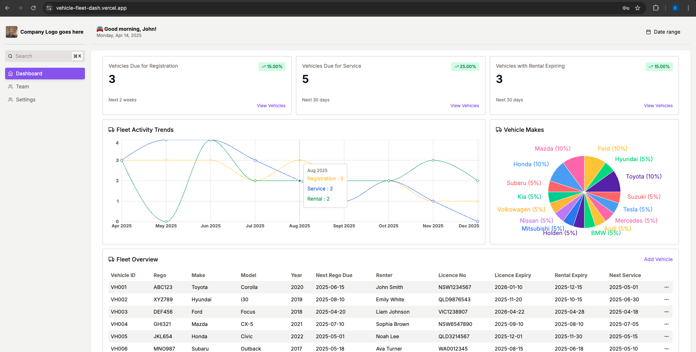
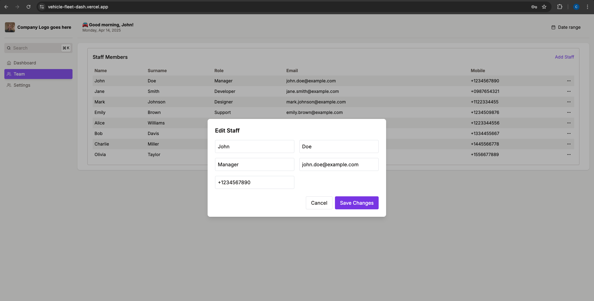
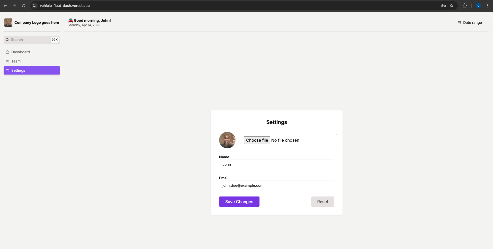

# 🚗 Vehicle Fleet Dashboard

This is a **Next.js** project for managing a vehicle rental fleet. It includes a modern dashboard with key statistics, vehicle management, user notification capabilities, and administrative settings.

---

## 🧪 Getting Started

To run the project locally:

```bash
npm run dev
# or
yarn dev
# or
pnpm dev
# or
bun dev
```

Then open [http://localhost:3000](http://localhost:3000) in your browser to view the application.

---

## 📸 Application Pages Overview

### 🔐 Login Page



> A secure authentication screen for users to access the platform.

---

### 📊 Dashboard



> A real-time overview of the vehicle fleet.

**Key Features:**
- 🚨 Stat cards for upcoming rego, services, and expiring rentals
- 🔍 Modal view with Notify button
- 📋 Fleet overview table with edit/delete actions

---

### 👥 Team Management



> Manage the members who have access to the dashboard.

**Features:**
- Add or remove team members
- Assign roles and permissions

---

### ⚙️ Settings



> Configure preferences and app-wide settings.

**Features:**
- Update account details
- Set notification preferences
- (Coming soon) API & integration settings

---

## 📦 Vehicle Data Structure

Here's an example of the vehicle data managed by the app:

```ts
{
  vehicleId: "VH017",
  rego: "QRS101",
  make: "Toyota",
  model: "HiLux",
  year: "2020",
  nextRegoDue: "2025-07-01",
  renterName: "Henry Cook",
  licenceNumber: "NT1223344",
  licenceExpiry: "2025-08-20",
  rentalExpiry: "2025-06-30",
  nextService: "2025-06-01",
}
```

---

## 🔔 Features

- ✅ Responsive dashboard UI (Tailwind CSS)
- 📈 Stat-based triggers and tracking
- ✍️ CRUD operations for vehicles
- 📦 Modal forms for edits and confirmation
- 🚀 Deploy-ready for Vercel

---

## 🚀 Deployment

The easiest way to deploy is using [Vercel](https://vercel.com/), the creators of Next.js.

Read more in the [Next.js deployment documentation](https://nextjs.org/docs/deployment).

---

## 📚 Learn More About Next.js

- [📘 Official Docs](https://nextjs.org/docs)
- [🎓 Interactive Tutorial](https://nextjs.org/learn)
- [💻 GitHub Repo](https://github.com/vercel/next.js)

---

## 🛠️ Coming Soon

- Role-based access for team members
- Detailed service history logs
- Upload feature for rental documents

---
"""
